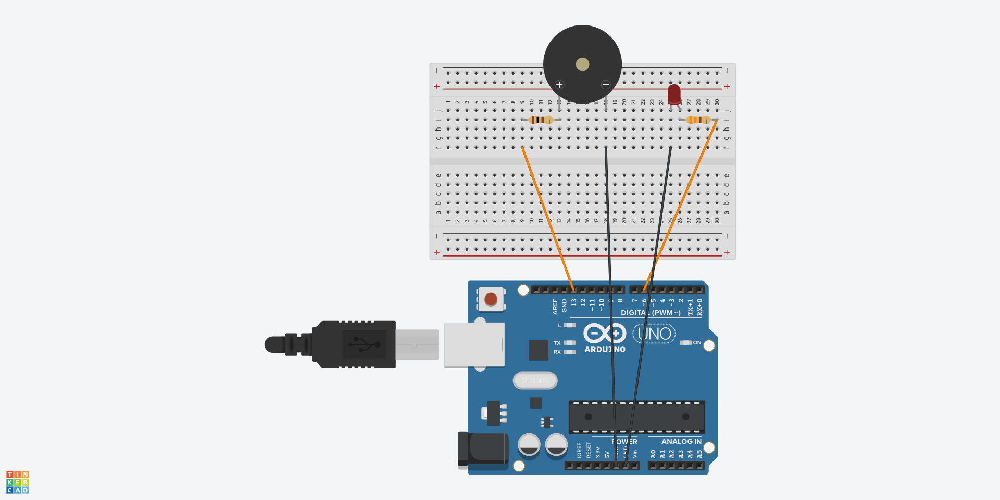

# 🚀 Projeto: Pisca LED e Buzzer

📌 **Descrição:**  
O projeto **Pisca LED e Buzzer** demonstra conceitos básicos de eletrônica e programação usando um **Arduino UNO**. Ele consiste em um LED que pisca e um buzzer que emite um som intermitente.

---

## 🔧 **Materiais Necessários**
| Quantidade | Componente         | Especificação |
|------------|--------------------|--------------|
| 1          | Arduino UNO        | Microcontrolador |
| 1          | Protoboard         | 400 pontos |
| 1          | LED Vermelho       | 5mm |
| 1          | Resistor           | 330Ω |
| 1          | Buzzer             | Ativo |
| 1          | Resistor           | 100Ω |
| Vários     | Jumpers            | Macho-macho |

📄 **Bill of Materials (BOM):** [Veja o arquivo BOM](./Docs/bom.csv)  

---

## 📷 **Esquema do Circuito**

Aqui está o **esquema elétrico** do projeto.  
📝 **Arquivo PDF**: [Download do esquema](./Docs/esquema.pdf) 
 
---

## 🛠️ **Montagem**
1. Conecte o **LED vermelho** em série com um **resistor de 330Ω** no **pino digital 7** do Arduino.
2. Conecte o **buzzer ativo** em série com um **resistor de 100Ω** no **pino digital 8** do Arduino.
3. Certifique-se de conectar os componentes ao **GND** do Arduino.
4. Suba o código no Arduino.


---

## 💻 **Código**
O código-fonte do projeto pode ser encontrado em [Codigo/pisca_led_buzzer.ino](./Codigo/pisca_led_buzzer.ino).

Exemplo de código:
```cpp
#define LED_PIN 7
#define BUZZER_PIN 8

void setup() {
  pinMode(LED_PIN, OUTPUT);
  pinMode(BUZZER_PIN, OUTPUT);
}

void loop() {
  digitalWrite(LED_PIN, HIGH);
  digitalWrite(BUZZER_PIN, HIGH);
  delay(500);
  digitalWrite(LED_PIN, LOW);
  digitalWrite(BUZZER_PIN, LOW);
  delay(500);
}
```

## 🖥️ **Layout da PCB**
Caso queira fabricar uma **placa de circuito impresso (PCB)** para este projeto, utilize o arquivo abaixo:

📂 **Arquivo de Layout (.brd)**: [Download do arquivo BRD](./Docs/layout.brd)

🔹 Você pode abrir esse arquivo usando o software [EAGLE](https://www.autodesk.com/products/eagle/overview) ou [KiCad](https://www.kicad.org/).  
🔹 O arquivo contém o **roteamento das trilhas** e o **posicionamento dos componentes** para produção da PCB.

---

## 🎯 **Objetivos de Aprendizado**
✔️ Compreender o funcionamento de um LED e um buzzer.  
✔️ Praticar conceitos básicos de programação no **Arduino**.  
✔️ Aprender a usar a função `digitalWrite()` e `delay()`.  
✔️ Desenvolver um circuito simples para interações visuais e sonoras.

---

## 🔗 **Referências**
- Documentação do Arduino: [arduino.cc](https://www.arduino.cc/)
- Documentação do Thinkercad: [thinkercad.com](https://www.tinkercad.com/)

---

📢 **Dúvidas? Sugestões?**  
Entre em contato por meio do repositório oficial.

🚀 **Divirta-se com seu projeto de robótica!**
