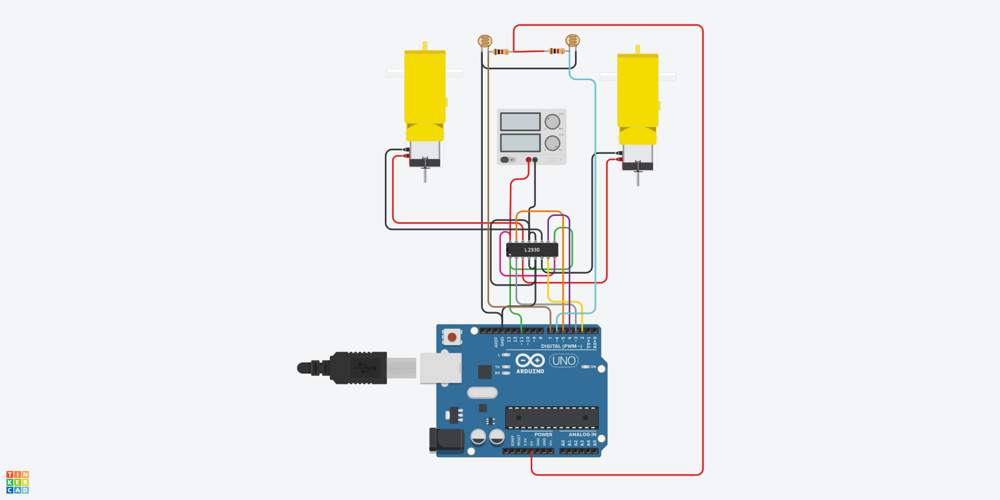

# 🤖 Projeto: Robô Seguidor de Linha

📌 **Descrição:**  
O **Robô Seguidor de Linha** utiliza sensores infravermelhos para detectar e seguir uma linha preta sobre um fundo claro. Ele é controlado por um **Arduino UNO** e um **driver de motor L293D**, permitindo a movimentação dos motores conforme as leituras dos sensores.

---

## 🔧 **Materiais Necessários**
| Quantidade | Componente         | Especificação |
|------------|--------------------|--------------|
| 1          | Arduino UNO        | Microcontrolador |
| 1          | Driver de Motor    | L293D |
| 2          | Sensores IR        | Reflexivos (TCRT5000 ou similares) |
| 2          | Motores DC         | Com caixa de redução |
| 2          | Rodas              | Compatíveis com os motores |
| 1          | Chassi             | Suporte para o robô |
| 1          | Fonte de Energia   | Bateria 7.4V ou similar |
| 4          | Resistores         | 1kΩ |
| Vários     | Jumpers            | Macho-macho |

📄 **Bill of Materials (BOM):** [Veja o arquivo BOM](./Docs/bom.csv)  

---

## 📷 **Esquema do Circuito**
Aqui está o **diagrama elétrico** do projeto.  
📝 **Arquivo PDF**: [Download do esquema](./Docs/esquema.pdf)  


---

## 🛠️ **Montagem**
1. **Conecte os Sensores IR**:
   - **VCC** → 5V do Arduino
   - **GND** → GND do Arduino
   - **Saída Sensor Esquerdo** → Pino digital **A0**
   - **Saída Sensor Direito** → Pino digital **A1**

2. **Conecte o Driver de Motores L293D**:
   - **Pinos de Controle**:
     - **1A (Entrada motor 1)** → Pino digital **5**
     - **2A (Entrada motor 1)** → Pino digital **6**
     - **3A (Entrada motor 2)** → Pino digital **9**
     - **4A (Entrada motor 2)** → Pino digital **10**
   - **Saídas para os Motores**:
     - **1Y, 2Y** → Motor Esquerdo
     - **3Y, 4Y** → Motor Direito
   - **Alimentação**:
     - **VCC1** → 5V do Arduino (Lógica)
     - **VCC2** → Fonte de 7.4V (Motores)
     - **GND** → GND do Arduino

3. **Conecte a Alimentação**:
   - Use uma bateria para alimentar os motores através do **L293D**.

---

## 💻 **Código**
O código-fonte do projeto pode ser encontrado em [Codigo/seguidor_de_linha.ino](./Codigo/seguidor_de_linha.ino).

Exemplo de código:
```cpp
#define SENSOR_ESQ A0
#define SENSOR_DIR A1

#define MOTOR1_A 5
#define MOTOR1_B 6
#define MOTOR2_A 9
#define MOTOR2_B 10

void setup() {
    pinMode(SENSOR_ESQ, INPUT);
    pinMode(SENSOR_DIR, INPUT);
    pinMode(MOTOR1_A, OUTPUT);
    pinMode(MOTOR1_B, OUTPUT);
    pinMode(MOTOR2_A, OUTPUT);
    pinMode(MOTOR2_B, OUTPUT);
}

void loop() {
    int esq = digitalRead(SENSOR_ESQ);
    int dir = digitalRead(SENSOR_DIR);

    if (esq == LOW && dir == LOW) {
        // Ambos sensores na linha → anda para frente
        moverFrente();
    } else if (esq == LOW && dir == HIGH) {
        // Somente sensor esquerdo detecta a linha → vira para a esquerda
        virarEsquerda();
    } else if (esq == HIGH && dir == LOW) {
        // Somente sensor direito detecta a linha → vira para a direita
        virarDireita();
    } else {
        // Nenhum sensor detecta a linha → parar
        parar();
    }
}

void moverFrente() {
    digitalWrite(MOTOR1_A, HIGH);
    digitalWrite(MOTOR1_B, LOW);
    digitalWrite(MOTOR2_A, HIGH);
    digitalWrite(MOTOR2_B, LOW);
}

void virarEsquerda() {
    digitalWrite(MOTOR1_A, LOW);
    digitalWrite(MOTOR1_B, HIGH);
    digitalWrite(MOTOR2_A, HIGH);
    digitalWrite(MOTOR2_B, LOW);
}

void virarDireita() {
    digitalWrite(MOTOR1_A, HIGH);
    digitalWrite(MOTOR1_B, LOW);
    digitalWrite(MOTOR2_A, LOW);
    digitalWrite(MOTOR2_B, HIGH);
}

void parar() {
    digitalWrite(MOTOR1_A, LOW);
    digitalWrite(MOTOR1_B, LOW);
    digitalWrite(MOTOR2_A, LOW);
    digitalWrite(MOTOR2_B, LOW);
}
```

---

## 🖥️ **Layout da PCB**
Caso queira fabricar uma **placa de circuito impresso (PCB)** para este projeto, utilize o arquivo abaixo:

📂 **Arquivo de Layout (.brd)**: [Download do arquivo BRD](./Docs/layout.brd)

🔹 Você pode abrir esse arquivo usando o software [EAGLE](https://www.autodesk.com/products/eagle/overview) ou [KiCad](https://www.kicad.org/).  
🔹 O arquivo contém o **roteamento das trilhas** e o **posicionamento dos componentes** para produção da PCB.

---

## 🎯 **Objetivos de Aprendizado**
✔️ Aprender a usar **sensores infravermelhos** para detecção de linha.  
✔️ Compreender o controle de **motores DC** usando o **L293D**.  
✔️ Aplicar lógica de **tomada de decisão** baseada em sensores.  
✔️ Desenvolver um sistema de **movimentação autônoma** para robôs.

---

## 📌 **Simulação Online**
Caso queira testar sem um Arduino físico, use o [Tinkercad](https://www.tinkercad.com/).

---

## 🔗 **Referências**
- Documentação do Arduino: [arduino.cc](https://www.arduino.cc/)

---

📢 **Dúvidas? Sugestões?**  
Entre em contato por meio do repositório oficial.

🚀 **Divirta-se com seu projeto de robótica!**
