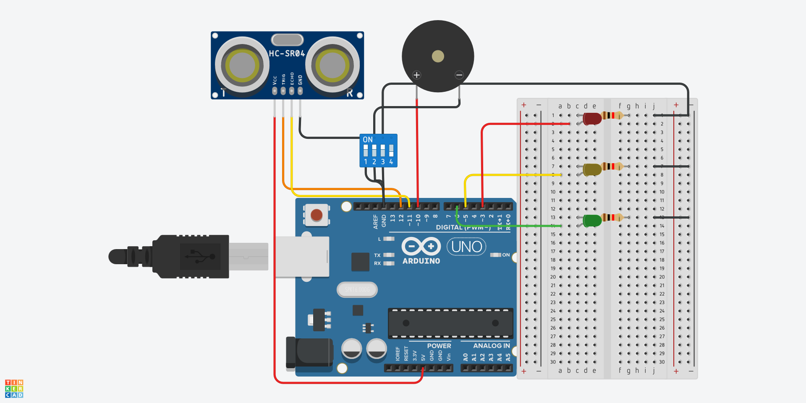

# 🚗 Projeto: Sensor de Estacionamento

📌 **Descrição:**  
O projeto **Sensor de Estacionamento** utiliza um sensor ultrassônico para medir a distância de objetos e fornece feedback visual e sonoro conforme a proximidade do obstáculo. O sistema alerta o usuário por meio de **LEDs de diferentes cores** e um **buzzer**.

---

## 🔧 **Materiais Necessários**
| Quantidade | Componente         | Especificação |
|------------|--------------------|--------------|
| 1          | Arduino UNO        | Microcontrolador |
| 1          | Protoboard         | 400 pontos |
| 1          | Sensor Ultrassônico | HC-SR04 |
| 1          | Buzzer             | Ativo |
| 1          | LED Vermelho       | 5mm |
| 1          | LED Amarelo        | 5mm |
| 1          | LED Verde          | 5mm |
| 3          | Resistores         | 1kΩ |
| Vários     | Jumpers            | Macho-macho |

📄 **Bill of Materials (BOM):** [Veja o arquivo BOM](./Docs/bom.csv)  

---

## 📷 **Esquema do Circuito**
Aqui está o **diagrama elétrico** do projeto.  
📝 **Arquivo PDF**: [Download do esquema](./Docs/esquema.pdf)  


---

## 🛠️ **Montagem**
1. Conecte o **sensor ultrassônico HC-SR04**:
   - **VCC** → 5V do Arduino
   - **GND** → GND do Arduino
   - **TRIG** → Pino digital **9**
   - **ECHO** → Pino digital **10**
   
2. Ligue os **LEDs** em série com resistores de **1kΩ**:
   - **LED vermelho** no pino digital **7**.
   - **LED amarelo** no pino digital **6**.
   - **LED verde** no pino digital **5**.

3. Conecte o **buzzer** no pino digital **3** do Arduino.

4. Certifique-se de que todos os componentes compartilham o mesmo **GND**.

---

## 💻 **Código**
O código-fonte do projeto pode ser encontrado em [Codigo/sensor_de_estacionamento.ino](./Codigo/sensor_de_estacionamento.ino).

Exemplo de código:
```cpp
#define TRIG_PIN 9
#define ECHO_PIN 10
#define LED_VERDE 5
#define LED_AMARELO 6
#define LED_VERMELHO 7
#define BUZZER 3

void setup() {
    pinMode(TRIG_PIN, OUTPUT);
    pinMode(ECHO_PIN, INPUT);
    pinMode(LED_VERDE, OUTPUT);
    pinMode(LED_AMARELO, OUTPUT);
    pinMode(LED_VERMELHO, OUTPUT);
    pinMode(BUZZER, OUTPUT);
    Serial.begin(9600);
}

void loop() {
    digitalWrite(TRIG_PIN, LOW);
    delayMicroseconds(2);
    digitalWrite(TRIG_PIN, HIGH);
    delayMicroseconds(10);
    digitalWrite(TRIG_PIN, LOW);

    long duration = pulseIn(ECHO_PIN, HIGH);
    int distance = duration * 0.034 / 2;

    Serial.print("Distância: ");
    Serial.print(distance);
    Serial.println(" cm");

    if (distance > 30) {
        digitalWrite(LED_VERDE, HIGH);
        digitalWrite(LED_AMARELO, LOW);
        digitalWrite(LED_VERMELHO, LOW);
        digitalWrite(BUZZER, LOW);
    } else if (distance > 15) {
        digitalWrite(LED_VERDE, LOW);
        digitalWrite(LED_AMARELO, HIGH);
        digitalWrite(LED_VERMELHO, LOW);
        digitalWrite(BUZZER, LOW);
    } else {
        digitalWrite(LED_VERDE, LOW);
        digitalWrite(LED_AMARELO, LOW);
        digitalWrite(LED_VERMELHO, HIGH);
        digitalWrite(BUZZER, HIGH);
    }

    delay(500);
}
```

---

## 🖥️ **Layout da PCB**
Caso queira fabricar uma **placa de circuito impresso (PCB)** para este projeto, utilize o arquivo abaixo:

📂 **Arquivo de Layout (.brd)**: [Download do arquivo BRD](./Docs/layout.brd)

🔹 Você pode abrir esse arquivo usando o software [EAGLE](https://www.autodesk.com/products/eagle/overview) ou [KiCad](https://www.kicad.org/).  
🔹 O arquivo contém o **roteamento das trilhas** e o **posicionamento dos componentes** para produção da PCB.

---

## 🎯 **Objetivos de Aprendizado**
✔️ Aprender a usar o **sensor ultrassônico HC-SR04** para medir distâncias.  
✔️ Compreender a lógica de tomada de decisão com base em entradas sensoriais.  
✔️ Integrar **LEDs e buzzer** para criar alertas visuais e sonoros.  
✔️ Programar o Arduino para interpretar sensores e reagir a estímulos externos.

---

## 📌 **Simulação Online**
Caso queira testar sem um Arduino físico, use o [Tinkercad](https://www.tinkercad.com/).

---

## 🔗 **Referências**
- Documentação do Arduino: [arduino.cc](https://www.arduino.cc/)
---

📢 **Dúvidas? Sugestões?**  
Entre em contato por meio do repositório oficial.

🚀 **Divirta-se com seu projeto de robótica!**
